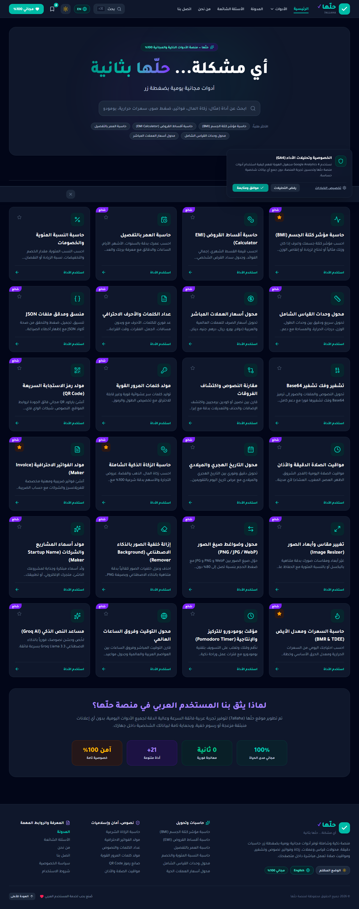
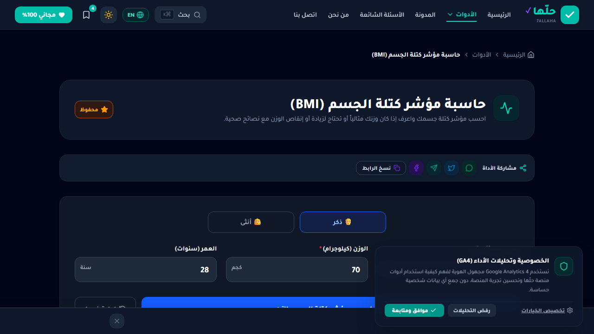
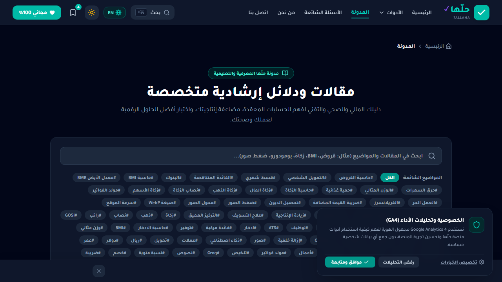

<div align="center">

# حلّها — أي مشكلة... حلّها بثانية ⚡

### منصة الأدوات اليومية المجانية للمستخدم العربي

[](https://7allaha.xyz)
[](https://github.com/RealFiras/7allaha/actions)
[](https://react.dev)
[](https://vitejs.dev)
[](https://tailwindcss.com)
[](LICENSE)

<p align="center">
  <b>28 أداة</b> • <b>66 مقال SEO</b> • <b>PWA Offline</b> • <b>ذكاء اصطناعي Groq</b> • <b>دعم كامل للدارك مود</b>
</p>

[جرّب الموقع الحي](https://7allaha.xyz) • [المدونة](https://7allaha.xyz/#/blog) • [اتصل بنا](https://7allaha.xyz/#/contact)

</div>

---

## ✨ نظرة سريعة

> **حلّها (7allaha)** منصة عربية مجانية 100% تجمع كل ما تحتاجه يومياً: حاسبات ذكية، محولات، أدوات صور بالذكاء الاصطناعي، مساعد نصوص بـ Groq، مواقيت صلاة، والمزيد — **بدون تسجيل، بدون إعلانات مزعجة، بسرعة البرق.**


---

## 🧰 الأدوات (28)

| الفئة | الأدوات |
|-------|---------|
| 🖼️ **صور** | إزالة الخلفية (AI) • تغيير المقاس • تحويل الصيغ (PNG/JPG/WebP) |
| 🧮 **حاسبات** | الراتب الصافي (GOSI) • الادخار (فائدة مركبة) • BMI • سعرات • زكاة • قروض EMI • نسبة مئوية • عمر |
| 🔄 **محولات** | عملات مباشر • وحدات • توقيت عالمي • تاريخ هجري |
| 📝 **نصوص وترميز** | مساعد AI (تلخيص/تحسين) • عداد كلمات • JSON • مقارنة نصوص • Base64 |
| 🔒 **أمان** | مولد كلمات مرور • QR • مواقيت الصلاة |
| 💼 **أعمال** | مولد فواتير • منشئ سيرة ذاتية AI • بومودورو |

---

## 🚀 التقنيات

<div align="center">

| Frontend | Styling | AI | Build & Deploy |
|----------|---------|----|----------------|
| React 19 | Tailwind 4 | Groq `allam-2-7b` | Vite 6 |
| TypeScript | motion | @imgly/bg-removal | GitHub Actions |
| Lucide Icons | — | qrcode | GitHub Pages |

</div>

**مميزات إضافية:** PWA Offline (`sw.js`) • `Schema.org` لكل أداة • Hotjar • Search Console • AdSense (4 أماكن + sticky) • Affiliate • دارك/لايت + عربي/إنجليزي

---

## 📸 لقطات

| الرئيسية | أداة BMI | المدونة |
|----------|------|---------|
|  |  |  |

---

## ⚡ شغّل محلياً

```bash
# 1. ثبّت الحزم
npm install

# 2. أضف المفاتيح في .env.local
cp .env.example .env.local
# VITE_GROQ_API_KEY="gsk_..."
# VITE_GA_MEASUREMENT_ID="G-..."
# VITE_HOTJAR_ID=""
# VITE_GSC_VERIFICATION=""

# 3. شغّل
npm run dev        # http://localhost:3000
npm run build      # إنتاج
npm run preview    # معاينة البناء
```

---

## 🌐 النشر (GitHub Pages + دومين خاص)

```bash
git push origin main   # الـ Workflow ينشر تلقائياً
```

**Workflow:** `.github/workflows/deploy.yml` — يبني `dist` ويرفعه عبر `actions/deploy-pages@v4`.

**الدومين:** `public/CNAME` = `7allaha.xyz`
- DNS: `A` → `185.199.108.153 / .109 / .110 / .111` + `CNAME www → realfiras.github.io`
- **Settings → Pages → Custom domain:** `7allaha.xyz` → **Enforce HTTPS**

---

## 🔑 متغيرات البيئة

| المتغير | الوصف |
|---------|-------|
| `VITE_GROQ_API_KEY` | مفتاح Groq (console.groq.com) للـ AI |
| `VITE_GA_MEASUREMENT_ID` | Google Analytics 4 |
| `VITE_HOTJAR_ID` | Hotjar Site ID |
| `VITE_GSC_VERIFICATION` | Google Search Console |
| `VITE_WEB3FORMS_ACCESS_KEY` | نموذج الاتصال |

> على GitHub Pages: **Settings → Secrets → Actions → New secret** بنفس الأسماء.

---

## 📝 المدونة SEO

66 مقال مولدة بـ Groq `allam-2-7b` في `src/data/seoBlogData*.ts` — توليد المزيد:
```bash
node scripts/generate-seo-articles.mjs
node scripts/generate-seo-batch3.mjs
```

---

## 🤝 المساهمة

```bash
git checkout -b feat/my-tool
# أضف أداتك في src/tools/ + سجلها في src/data/toolsData.ts
npm run lint && npm run build
# افتح Pull Request
```

---

## 📄 الترخيص

MIT — استخدمه كما تشاء، مع ذكر المصدر.

<div align="center">

**صُنع بحب للمستخدم العربي ❤️**

[7allaha.xyz](https://7allaha.xyz) • [GitHub](https://github.com/RealFiras/7allaha)

</div>
